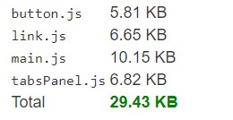

# react-common-components-library 
 Librería de componentes React [react-common-components-library](https://github.com/DarioLM/react-common-components-library).

 StoryBook disponible en: https://dariolm.github.io/react-common-components-library/

## Engines

De forma local se han usado las siguientes versiones de:
- **NodeJS**: 10.16.3
- **Yarn**: 1.17.3
- **Npm**: 6.9.0

## Tecnologías usadas

- TypeScript
- SASS
- React
- Webpack: Code Splitting, SplitChunks.

  
- Jest
- StoryBook: Visualizador y playground de los componentes y sus diferentes estados.

  El Storybook puede visitarse en el propio repositorio visitando [StoryBook](https://dariolm.github.io/react-common-components-library/?path=/story/button--primary)

### `npm install`

Se instalarán las dependencias necesarias.

### `yarn storybook o npm run-script storybook`

Compilará y abrirá el [Storybook](https://dariolm.github.io/react-common-components-library/?path=/story/button--primary) del proyecto en el puerto 6006. 

### `yarn test o npm run-script test`

Lanzará Jest contra todos los tests disponibles en el proyecto.

### `yarn build o npm run-script build`

Se compilará (en modo producción) la aplicación para permitir su publicación y posterior uso.

Cabe destacar que "prePublish" está configurado para ejecutar build antes de cada "npm publish".

    Nota: Eliminar carpertas *build* y *modules* antes de la ejecución de una nueva build.

## Importante

Todos los componentes se pueden consultar y visualizar en el **Storybook**.

Se han configurado los "entry points" de la aplicación de forma que cada componente individual **[Button, Link, TabsPanel]** se
exponga en chunks separados, permitiendo imports dinámicos y evitando que todo se compile en un solo bundle.

La síntaxis para el uso de la librería es el siguiente:

    import <Componente> @dariolm/react-common-components-library/modules/<componente>
